* 官网：https://cn.vuejs.org/

* Vue (发音为 /vjuː/，类似 view) 是一款用于构建用户界面的 JavaScript 框架。

* 它基于标准 HTML、CSS 和 JavaScript 构建，并提供了一套声明式的、组件化的编程模型，帮助你高效地开发用户界面。无论是简单还是复杂的界面，Vue 都可以胜任。

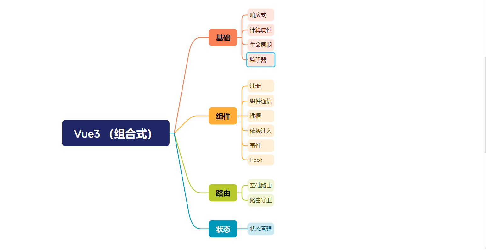

## 一  开发环境配置

### 1.1 特点

> 性能提升

* 打包大小减少`41%`。

* 初次渲染快`55%`, 更新渲染快`133%`。

* 内存减少`54%`。

> 源码重写

* 使用`Proxy`代替`defineProperty`实现响应式。

* 重写虚拟`DOM`的实现和`Tree-Shaking`。

> 拥抱Ts

* `Vue3`可以更好的支持`TypeScript`。

> 新的特性

1. `Composition API`（组合`API`）：

   * `setup`

   * `ref`与`reactive`

   * `computed`与`watch`

   * ......

2. 新的内置组件：

   * `Fragment`

   * `Teleport`

   * `Suspense`

   * ......

3. 其他改变：

   * 新的生命周期钩子

   * `data` 选项应始终被声明为一个函数

   * 移除`keyCode`支持作为` v-on` 的修饰符

   * ......

### 1.2 创建Vue工程

* Vite 需要 [Node.js](https://nodejs.org/en/) 版本 18+ 或 20+。然而，有些模板需要依赖更高的 Node 版本才能正常运行，当你的包管理器发出警告时，请注意升级你的 Node 版本。

#### 1.2.1 基于 vue-cli 创建

点击查看[官方文档](https://gitee.com/link?target=https%3A%2F%2Fcli.vuejs.org%2Fzh%2Fguide%2Fcreating-a-project.html%23vue-create)

> 备注：目前`vue-cli`已处于维护模式，官方推荐基于 `Vite` 创建项目。

```bash
## 查看@vue/cli版本，确保@vue/cli版本在4.5.0以上
vue --version## 安装或者升级你的@vue/cli 
npm install -g @vue/cli

## 执行创建命令
vue create vue_test

##  随后选择3.x##  Choose a version of Vue.js that you want to start the project with (Use arrow keys)##  > 3.x##    2.x## 启动
cd vue_test
npm run serve
```

#### 1.2.2 基于 vite 创建 (推荐)

* https://vitejs.cn/vite5-cn/

`vite` 是新一代前端构建工具，官网地址：[https://vitejs.cn](https://gitee.com/link?target=https%3A%2F%2Fvitejs.cn%2F)，`vite`的优势如下：

* 轻量快速的热重载（`HMR`），能实现极速的服务启动。

* 对 `TypeScript`、`JSX`、`CSS` 等支持开箱即用。

* 真正的按需编译，不再等待整个应用编译完成。

* `webpack`构建 与 `vite`构建对比图如下：&#x20;

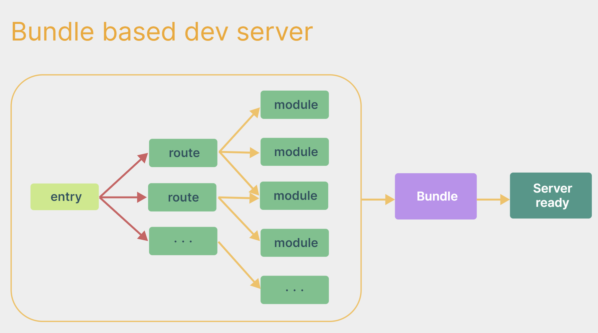

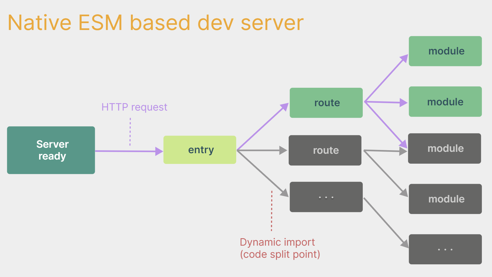

* 具体操作如下（点击查看[官方文档](https://gitee.com/link?target=https%3A%2F%2Fcn.vuejs.org%2Fguide%2Fquick-start.html%23creating-a-vue-application)）

```bash
## 1.创建命令
npm create vue@latest
## 2.具体配置## 配置项目名称
√ Project name: vue3_test
## 是否添加TypeScript支持
√ Add TypeScript?  Yes
## 是否添加JSX支持
√ Add JSX Support?  No
## 是否添加路由环境
√ Add Vue Router for Single Page Application development?  No
## 是否添加pinia环境
√ Add Pinia for state management?  No
## 是否添加单元测试
√ Add Vitest for Unit Testing?  No
## 是否添加端到端测试方案
√ Add an End-to-End Testing Solution? » No
## 是否添加ESLint语法检查
√ Add ESLint for code quality?  Yes
## 是否添加Prettiert代码格式化
√ Add Prettier for code formatting?  No
```

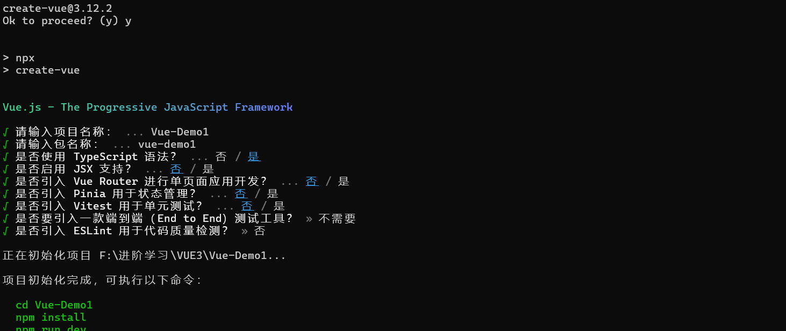

* 目录

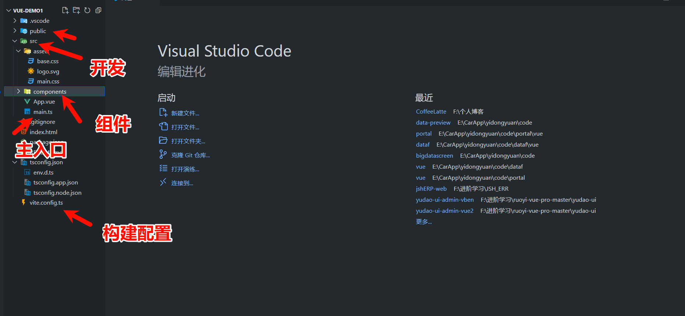

```plain&#x20;text
my-vue3-project/
├── public/           # 静态资源文件夹，其中的文件会直接复制到构建输出目录中，无需经过编译处理
│   ├── favicon.ico    # 网站图标
│   └── index.html    # 应用程序入口HTML文件，Vue应用将挂载于此文件中的特定元素上

├── src/
│   ├── assets/        # 静态资源目录，包含图片、字体等未经过webpack编译的文件，可使用import导入并在构建时进行处理
│   ├── components/    # 组件目录，按照功能或类别划分存放单文件组件（.vue文件）
│   │   ├── Common/     # 公共组件目录
│   │   ├── Layout/     # 布局组件目录
│   │   └── ...         # 其他分类组件目录
│   ├── directives/    # 自定义指令目录，存放Vue自定义指令实现
│   ├── hooks/         # Vue Composition API 的自定义 Hooks 目录，用于组织和复用可组合的逻辑单元
│   ├── layouts/       # 应用布局相关的组件存放处，例如通用页面布局组件
│   │   ├── AppLayout.vue 
│   │   └── ...         # 其他布局相关页面组件
│   ├── pages/          # 页面组件目录，根据功能模块划分不同页面组件
│   │   ├── Home/       # 主页或首页相关页面组件
│   │   │   ├── Index.vue
│   │   │   └── ...
│   │   ├── User/       # 用户管理相关的页面组件
│   │   │   ├── Profile.vue
│   │   │   ├── Settings.vue
│   │   │   └── ...
│   │   ├── Product/    # 产品管理相关的页面组件
│   │   │   ├── List.vue
│   │   │   ├── Detail.vue
│   │   │   └── ...
│   │   └── ...         # 其他功能模块的页面组件目录
│   ├── plugins/       # Vue 插件配置目录，存放全局注册的插件及其配置
│   ├── router/        # 路由配置目录，主要包含index.js路由文件，用于配置应用程序的路由规则
│   ├── store/         # Vuex 状态管理目录，用于集中管理组件状态和数据流
│   ├── styles/        # 样式文件目录，包括全局样式、主题样式等
│   ├── utils/         # 工具函数和类库目录，存放项目中常用的工具函数、辅助类等
│   ├── App.vue        # 应用程序根组件，整个应用的入口点，通常包含路由视图和其他全局共享组件
│   ├── main.ts        # 应用程序入口脚本，用于初始化Vue实例、引入并配置路由、状态管理等核心模块
│   └── shims-vue.d.ts # TypeScript 类型声明文件，为Vue相关API提供类型支持

├── tests/             # 测试相关文件目录，存放单元测试、集成测试等代码
├── .env.*             # 环境变量配置文件，根据不同环境如开发、生产等设置不同的环境变量
├── .eslintrc.js       # Eslint 配置文件，用于定义项目的代码风格规范和错误检查规则
├── .gitignore         # Git 忽略文件，列出不需要添加到版本控制的文件或目录
├── package-lock.json       #  npm 包管理器中用于锁定项目依赖版本的文件
├── package.json       # npm 包配置文件，包括项目依赖、脚本命令、项目信息等元数据
├── vite.config.ts     # Vite 构建工具的配置文件，用于定制Vite的构建行为（如果使用Vite构建系统）
├── README.md          # 项目文档和说明文件，介绍项目结构、启动方式及注意事项等
├── tsconfig.json          # TypeScript 项目的核心配置文件，用于指定编译选项、包含的源文件、排除的文件等信息
├── tsconfig.node.json          # 针对 Node.js 应用程序进行更细粒度的 TypeScript 编译设置
├── .prettierrc        # Prettier 代码格式化配置文件，定义代码格式化规则
├── .ls-lint.yml       # Linting 规则配置文件，例如针对Less预处理器的代码风格检查规则
└── changelog.md       # 更新日志文件，记录项目的版本迭代和更新内容

```

* 推荐安装插件

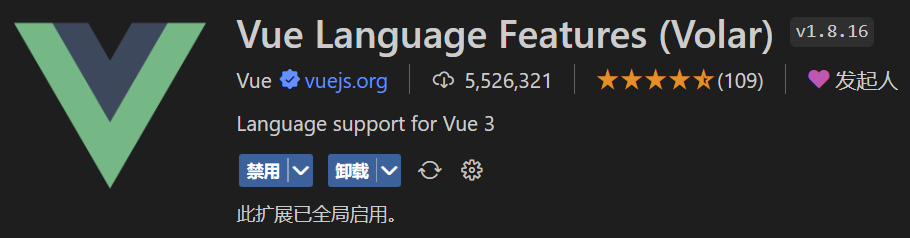

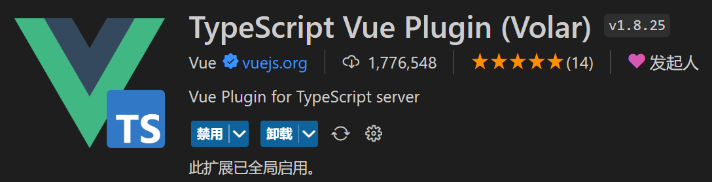

* 安装依赖

```plain&#x20;text
npm install
```

* 运行

```plain&#x20;text
npm run dev
```

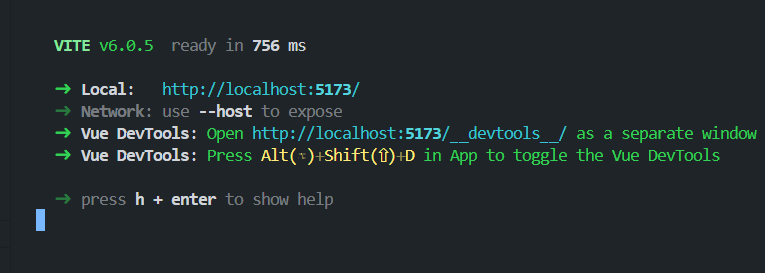

总结：

* `Vite` 项目中，`index.html` 是项目的入口文件，在项目最外层。

* 加载`index.html`后，`Vite` 解析 `<script type="module" src="xxx">` 指向的`JavaScript`。

* `Vue3`\*\*中是通过 \*\*`createApp` 函数创建一个应用实例。

#### 1.2.3 简单案例

```html
<template>
  <div class="person">
    <h2>姓名：{{ name }}</h2>
    <h2>年龄：{{ age }}</h2>
    <button @click="changeName">修改名字</button>
    <button @click="changeAge">年龄+1</button>
    <button @click="showTel">点我查看联系方式</button>
  </div>
</template>

<script lang="ts">
export default {
  name: "App",
  data() {
    return {
      name: "张三",
      age: 18,
      tel: "13888888888",
    };
  },
  methods: {
    changeName() {
      this.name = "zhang-san";
    },
    changeAge() {
      this.age += 1;
    },
    showTel() {
      alert(this.tel);
    },
  },
};
</script>
<style>
.person {
  background-color: #f00;
  padding: 20px;
}
</style>
```


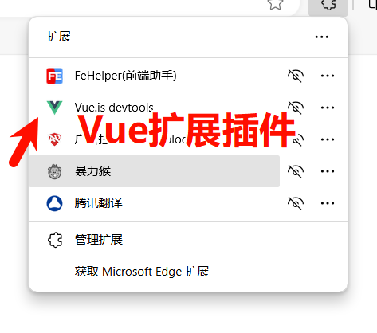

## 二 Vue3 核心语法

### 2.1 OptionsAPI 与 CompositionAPI

* `Vue2`的`API`设计是`Options`（配置）风格的。

* `Vue3`的`API`设计是`Composition`（组合）风格的。

> 选项式

`Options`类型的 `API`，数据、方法、计算属性等，是分散在：`data`、`methods`、`computed`中的，若想新增或者修改一个需求，就需要分别修改：`data`、`methods`、`computed`，不便于维护和复用。

* 参考文章：https://juejin.cn/post/6890545920883032071

### 2.2  Setup  （开始）

`setup`是`Vue3`中一个新的配置项，值是一个函数，它是 `Composition API` “表演的舞&#x53F0;*”*，组件中所用到的：数据、方法、计算属性、监视......等等，均配置在`setup`中。

特点如下：

* `setup`函数返回的对象中的内容，可直接在模板中使用。

* `setup`中访问`this`是`undefined`。

* `setup`函数会在`beforeCreate`之前调用，它是“领先”所有钩子执行的。

```html
<template>
  <div class="person">
    <h2>姓名：{{name}}</h2>
    <h2>年龄：{{age}}</h2>
    <button @click="changeName">修改名字</button>
    <button @click="changeAge">年龄+1</button>
    <button @click="showTel">点我查看联系方式</button>
  </div>
</template>

<script lang="ts">
  export default {
    name:'Person',
    setup(){
      // 数据，原来写在data中（注意：此时的name、age、tel数据都不是响应式数据）
      let name = '张三'
      let age = 18
      let tel = '13888888888'
      // 方法，原来写在methods中
      function changeName(){
        name = 'zhang-san' //注意：此时这么修改name页面是不变化的
        console.log(name)
      }
      function changeAge(){
        age += 1 //注意：此时这么修改age页面是不变化的
        console.log(age)
      }
      function showTel(){
        alert(tel)
      }
      // 返回一个对象，对象中的内容，模板中可以直接使用
      return {name,age,tel,changeName,changeAge,showTel}
    }
  }
</script>
```

> setup 的返回值

* 若返回一个对象：则对象中的：属性、方法等，在模板中均可以直接使用\*\*（重点关注）。\*\*

* 若返回一个函数：则可以自定义渲染内容，代码如下：

```plain&#x20;text
setup(){return ()=> '你好啊！'
}
```

> setup 与 Options API 的关系

* `Vue2` 的配置（`data`、`methos`......）中可以访问到 `setup`中的属性、方法。

* 但在`setup`中不能访问到`Vue2`的配置（`data`、`methos`......）。

* 如果与`Vue2`冲突，则`setup`优先。

> 语法糖

`setup`函数有一个语法糖，这个语法糖，可以让我们把`setup`独立出去

```html
<script setup lang="ts">
  console.log(this) //undefined
  
  // 数据（注意：此时的name、age、tel都不是响应式数据）
  let name = '张三'
  let age = 18
  let tel = '13888888888'

  // 方法
  function changName(){
    name = '李四'//注意：此时这么修改name页面是不变化的
  }
  function changAge(){
    console.log(age)
    age += 1 //注意：此时这么修改age页面是不变化的
  }
  function showTel(){
    alert(tel)
  }
</script>
```

扩展：上述代码，还需要编写一个不写`setup`的`script`标签，去指定组件名字，比较麻烦，我们可以借助`vite`中的插件简化

1. 第一步：`npm i vite-plugin-vue-setup-extend -D`

2. 第二步：`vite.config.ts`

```plain&#x20;text
import { defineConfig } from 'vite'import VueSetupExtend from 'vite-plugin-vue-setup-extend'export default defineConfig({plugins: [ VueSetupExtend() ]
})
```

3. 第三步：`<script setup lang="ts" name="Person">`

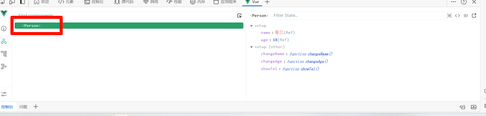

### 2.3 Ref （基本数据与对象类型）

> 基本类型

* 作用：定义响应式变量。

* 语法：`let xxx = ref(初始值)`。

* 返回值：一个`RefImpl`的实例对象，简称`ref对象`或`ref`，`ref`对象的`value`属性是响应式的。

* 注意点：

  * `tS`中操作数据需要：`xxx.value`，但模板中不需要`.value`，直接使用即可。

  * 何时需要`.value`？模板中不需要；包裹在响应式对象里面的ref不需要；未包裹的ref需要。

  * 对于`let name = ref('张三')`来说，`name`不是响应式的，`name.value`是响应式的。

```html
<template>
  <div class="person">
    <h2>姓名：{{ name }}</h2>
    <h2>年龄：{{ age }}</h2>
    <button @click="changeName">修改名字</button>
    <button @click="changeAge">年龄+1</button>
    <button @click="showTel">点我查看联系方式</button>
  </div>
</template>

<!-- <script lang="ts">
  export default {
    setup(){
      // 数据，原来写在data中（注意：此时的name、age、tel数据都不是响应式数据）
      let name = '张三'
      let age = 18
      let tel = '13888888888'

      // 方法，原来写在methods中
      function changeName(){
        name = 'zhang-san' //注意：此时这么修改name页面是不变化的
        console.log(name)
      }
      function changeAge(){
        age += 1 //注意：此时这么修改age页面是不变化的
        console.log(age)
      }
      function showTel(){
        alert(tel)
      }
      // 返回一个对象，对象中的内容，模板中可以直接使用
      return {name,age,tel,changeName,changeAge,showTel}
    }
  }
</script> -->

<script lang="ts" >
import { ref } from 'vue';

export default {
  name: "App",
  setup() { 
    const name = ref("张三");
    const age = ref(18);

    const changeName = () => {
      name.value = "李四";
    };
    const changeAge = () => {
      age.value++;
    };
    const showTel = () => {
      alert("123456789");
    };

    return {
      name,
      age,
      changeName,
      changeAge,
      showTel
    };
  },
};
</script>

<!-- <script setup lang="ts" name="Person">
import { ref } from 'vue';
const name = ref("张三");
const age = ref(18);
const changeName = () => {
  name.value = "李四";
};
const changeAge = () => {
  age.value++;
};
const showTel = () => {
  alert("123456789");
};

</script> -->

<style>
.person {
  background-color: #f00;
  padding: 20px;
  border-radius: 10px;
  box-shadow: 0 0 10px #000;
  width: 200px;
  margin: 0 auto;
  text-align: center;
  color: #fff;
  font-size: 20px;
  line-height: 40px;
  margin-top: 20px;
  display: inline-block;
  vertical-align: top;

}
</style>
```

> 对象类型

* 其实`ref`接收的数据可以是：基本类型、对象类型。

* 若`ref`接收的是对象类型，内部其实也是调用了`reactive`函数。

```html
<template>
  <div class="person">
    <h2>汽车信息：一台{{ car.brand }}汽车，价值{{ car.price }}万</h2>
    <h2>游戏列表：</h2>
    <ul>
      <li v-for="g in games" :key="g.id">{{ g.name }}</li>
    </ul>
    <h2>测试：{{obj.a.b.c.d}}</h2>
    <button @click="changeCarPrice">修改汽车价格</button>
    <button @click="changeFirstGame">修改第一游戏</button>
    <button @click="test">测试</button>
  </div>
</template>

<script lang="ts" setup name="Person">
import { ref } from 'vue'

// 数据
let car = ref({ brand: '奔驰', price: 100 })
let games = ref([
  { id: 'ahsgdyfa01', name: '英雄联盟' },
  { id: 'ahsgdyfa02', name: '王者荣耀' },
  { id: 'ahsgdyfa03', name: '原神' }
])
let obj = ref({
  a:{
    b:{
      c:{
        d:666
      }
    }
  }
})

console.log(car)

function changeCarPrice() {
  car.value.price += 10
}
function changeFirstGame() {
  games.value[0].name = '流星蝴蝶剑'
}
function test(){
  obj.value.a.b.c.d = 999
}
</script>
```

### 2.4 Reactive（限定对象类型）

* 作用：定义一个响应式对象（基本类型不要用它，要用`ref`，否则报错）

* 语法：`let 响应式对象= reactive(源对象)`。

* 返回值：一个`Proxy`的实例对象，简称：响应式对象。

* 注意点：`reactive`定义的响应式数据是“深层次”的。

```html
<template>
  <div class="person">
    <h2>姓名：{{ name }}</h2>
    <h2>年龄：{{ age }}</h2>
    <button @click="changeName">修改名字</button>
    <button @click="changeAge">年龄+1</button>
    <button @click="showTel">点我查看联系方式</button>
    <div>
      {{ person.name }}-- {{ person.age }}-- {{ person.tel }}
    </div>

  </div>
</template>

<!-- <script lang="ts">
  export default {
    setup(){
      // 数据，原来写在data中（注意：此时的name、age、tel数据都不是响应式数据）
      let name = '张三'
      let age = 18
      let tel = '13888888888'

      // 方法，原来写在methods中
      function changeName(){
        name = 'zhang-san' //注意：此时这么修改name页面是不变化的
        console.log(name)
      }
      function changeAge(){
        age += 1 //注意：此时这么修改age页面是不变化的
        console.log(age)
      }
      function showTel(){
        alert(tel)
      }
      // 返回一个对象，对象中的内容，模板中可以直接使用
      return {name,age,tel,changeName,changeAge,showTel}
    }
  }
</script> -->

<script lang="ts" >
import { reactive, ref } from 'vue';

export default {
  name: "App",
  setup() { 
    const name = ref("张三");
    const age = ref(18);
    // reactive 创建：对象类型的响应式数据
    const person = reactive({
      name: "张三",
      age: 18,
      tel: "13888888888",
    });

    const changeName = () => {
      name.value = "李四";
      console.log(name.value);
      console.log(person.name);
      person.name = "李四";
      
    };
    const changeAge = () => {
      age.value++;
    };
    const showTel = () => {
      alert("123456789");
    };

    return {
      name,
      age,
      person,
      changeName,
      changeAge,
      showTel
    };
  },
};
</script>

<!-- <script setup lang="ts" name="Person">
import { ref } from 'vue';
const name = ref("张三");
const age = ref(18);
const changeName = () => {
  name.value = "李四";
};
const changeAge = () => {
  age.value++;
};
const showTel = () => {
  alert("123456789");
};

</script> -->

<style>
.person {
  background-color: #f00;
  padding: 20px;
  border-radius: 10px;
  box-shadow: 0 0 10px #000;
  width: 200px;
  margin: 0 auto;
  text-align: center;
  color: #fff;
  font-size: 20px;
  line-height: 40px;
  margin-top: 20px;
  display: inline-block;
  vertical-align: top;

}
</style>
```

### 2.5 Ref 对比 Reactive

宏观角度看：

> 1. `ref`用来定义：基本类型数据、对象类型数据；
>
> 2. `reactive`用来定义：对象类型数据。

* 区别：

> 1. `ref`创建的变量必须使用`.value`（可以使用`volar`插件自动添加`.value`）。
>
> 
>
> 1. `reactive`重新分配一个新对象，会失去响应式（可以使用`Object.assign`去整体替换）。
>
> `Object.assign(car, { brand: '奥拓', price: 1 })`

* 使用原则：

> 1. 若需要一个基本类型的响应式数据，必须使用`ref`。
>
> 2. 若需要一个响应式对象，层级不深，`ref`、`reactive`都可以。
>
> 3. 若需要一个响应式对象，且层级较深，推荐使用`reactive`。

### 2.6 ToRefs 与 ToRef

* 作用：将一个响应式对象中的每一个属性，转换为`ref`对象。并且改变解构的值，也会影响到原响应式对象的值。

* 备注：`toRefs`与`toRef`功能一致，但`toRefs`可以批量转换。

```html
<template>
  <div class="person">
    <h2>姓名：{{person.name}}</h2>
    <h2>年龄：{{person.age}}</h2>
    <h2>性别：{{person.gender}}</h2>
    <button @click="changeName">修改名字</button>
    <button @click="changeAge">修改年龄</button>
    <button @click="changeGender">修改性别</button>
  </div>
</template>

<script lang="ts" setup name="Person">
  import {ref,reactive,toRefs,toRef} from 'vue'

  // 数据
  let person = reactive({name:'张三', age:18, gender:'男'})
        
  // 通过toRefs将person对象中的n个属性批量取出，且依然保持响应式的能力
  //改变name和gender的值，也会影响到person里面的值
  let {name,gender} =  toRefs(person)
        
  // 通过toRef将person对象中的gender属性取出，且依然保持响应式的能力
  let age = toRef(person,'age')

  // 方法
  function changeName(){
    name.value += '~'
  }
  function changeAge(){
    age.value += 1
  }
  function changeGender(){
    gender.value = '女'
  }
</script>
```

### 2.7 Computed (计算属性)

* 作用：根据已有数据计算出新数据（和`Vue2`中的`computed`作用一致）。

* 实现同样的功能，方法function没有缓存，模板调用几次，函数就执行几次；计算属性computed有缓存，模板调用多次，实际上只执行一次。

* 计算属性实际上是一个ref响应式对象，因此赋值时候需要加上`.value`。

```html
<template>
  <div class="person">
    姓：<input type="text" v-model="firstName"> <br>
    名：<input type="text" v-model="lastName"> <br>
    全名：<span>{{fullName}}</span> <br>
    全名：<span>{{fullName}}</span> <br>
    <button @click="changeFullName">全名改为：li-si</button>
  </div>
</template>

<script setup lang="ts" name="App">
  import {ref,computed} from 'vue'        //引入computed

  let firstName = ref('zhang')
  let lastName = ref('san')

  // 计算属性——只读取，不修改
  /* let fullName = computed(()=>{
    return firstName.value + '-' + lastName.value
  }) */


  // 计算属性——既读取又修改
  let fullName = computed({
    // 读取
    get(){
      return firstName.value + '-' + lastName.value
    },
    // 修改
    set(val){
      console.log('有人修改了fullName',val)
      firstName.value = val.split('-')[0]
      lastName.value = val.split('-')[1]
      //第二种写法  
      //const [str1,str2] = val.split('-')
      //firstName.value = str1
      //lastName.value = str2
    }
  })

  function changeFullName(){
    fullName.value = 'li-si'        //引起set的val变化
  } 
</script>
```


### 2.8 Watch (监听)

* 作用：监视数据的变化（和`Vue2`中的`watch`作用一致）

* 特点：`Vue3`中的`watch`只能监视以下四种数据：

> 1. `ref`定义的数据。
>
> 2. `reactive`定义的数据。
>
> 3. 函数返回一个值（`getter`函数）。
>
> 4. 一个包含上述内容的数组。

> 1：监视`ref`定义的【基本类型】数据：直接写数据名即可，监视的是其`value`值的改变

```html
<template>
  <div class="person">
    姓：<input type="text" v-model="firstName"> <br>
    名：<input type="text" v-model="lastName"> <br>
    全名：<span>{{fullName}}</span> <br>
    全名：<span>{{fullName}}</span> <br>
    <button @click="changeFullName">全名改为：li-si</button>
  </div>
</template>

<script setup lang="ts" name="App">
  import {ref,computed, watch} from 'vue' //引入computed
  let firstName = ref('zhang')
  let lastName = ref('san')
  // 计算属性——既读取又修改
  let fullName = computed({
    // 读取
    get(){
      return firstName.value + '-' + lastName.value
    },
    // 修改
    set(val){
      console.log('有人修改了fullName',val)
      firstName.value = val.split('-')[0]
      lastName.value = val.split('-')[1]
      //第二种写法  
      //const [str1,str2] = val.split('-')
      //firstName.value = str1
      //lastName.value = str2
    }
  })
  // 监听
  watch(fullName,newValue=>{
    console.log('fullName变化了',newValue)
  })

  function changeFullName(){
    fullName.value = 'li-si'  //引起set的val变化
  } 
</script>
```

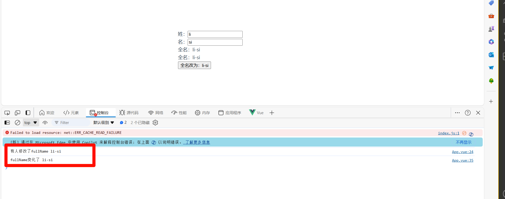

> 2: `reactive`定义的数据

* 监视`reactive`定义的【对象类型】数据，且默认开启了深度监视，且深层监视无法关闭。

* 无法监视地址值，因为对象地址值没有改变，本质上assign在原对象上进行的是赋值。

* `newValue`和`oldValue`值相同，都是新值，还是因为对象地址值没有改变，本质上assign在原对象上进行的是赋值。

```html
<template>
  <div class="person">
    {{person.age}}-- {{person.name}}
    <button @click="changeFullName">全名改为：li-si</button>
  </div>
</template>

<script setup lang="ts" name="App">
  import {computed, watch, reactive} from 'vue' //引入computed
  let person=reactive({
    name:'zhangsan',
    age:18
  })
  watch(person,newValue=>{
    console.log('person变化了',newValue)
  })
  function changeFullName(){
    // person.age=20 // 对象本身未发生改变,监听的值未发生改变
    Object.assign(person,{age:30,name:'lisi'})// 对象本身发生改变
  } 
</script>
```

> 3: ref 定义的对象数据

监视`ref`定义的【对象类型】数据：直接写数据名，监视的是对象的【地址值】，若想监视对象内部的数据，要手动开启深度监视。

> 注意：
>
> * 若修改的是`ref`定义的对象中的属性，`newValue` 和 `oldValue` 都是新值，因为它们是同一个对象。
>
> * 若修改整个`ref`定义的对象，`newValue` 是新值， `oldValue` 是旧值，因为不是同一个对象了。

```html
<template>
  <div class="person">
    {{person.age}}-- {{person.name}}
    <button @click="changeFullName">全名改为：li-si</button>
  </div>
</template>

<script setup lang="ts" name="App">
  import {ref, watch, reactive} from 'vue'  //引入computed
  let person=ref({
    name:'zhangsan',
    age:18
  })
  watch(person,newValue=>{
    console.log('person变化了',newValue)
  },{deep:true,immediate:true})
  function changeFullName(){
    person.value= {
      name:'li-si',
      age:20
    }
   
  } 
</script>
```

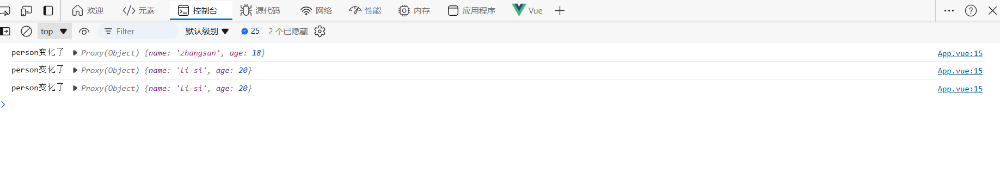

> 4: 监视`ref`或`reactive`定义的【对象类型】数据中的某个属性

1. 若该属性值不是【对象类型】即【基本类型】，需要写成函数形式，此时oldValue是旧值，newValue是新值。

2. 若该属性值是依然是【对象类型】，可直接编，也可写成函数，建议写成函数。

> * 直接写：可以监视到对象内部属性a，b...的变化，但是监视不到整体的变化。整体改变时，对象地址值变化了，所以监视不到了。
>
> * 写函数（不开启深度监视）：监视不到对象内部属性a，b...的变化，但是可以监视到整体的变化，函数返回值监视的是对象的地址值，改变整体是产生一个新对象，所以能监视到，并且新值是新值，旧值是旧值。（不过对象内部属性a，b...的新旧值都是新值）
>
> * 写函数（开启深度监视）推荐：既能监视到对象内部属性a，b...的变化，也可以监视到整体的变化，函数返回值监视的是对象的地址值，改变整体是产生一个新对象，所以能监视到，并且新值是新值，旧值是旧值。（不过对象内部属性a，b...的新旧值都是新值）

结论：监视的要是对象里的属性，那么最好写函数式。

注意点：若是对象监视的是地址值，需要关注对象内部，需要手动开启深度监视。

```html
<template>
  <div class="person">
    {{person.age}}-- {{person.name}}
    <button @click="changeFullName">全名改为：li-si</button>
  </div>
</template>

<script setup lang="ts" name="App">
  import {ref, watch, reactive} from 'vue'  //引入computed
  let person=reactive({
    name:'zhangsan',
    age:18
  })
  // 如果是属性，需要写成函数式
  watch(()=> person.name,newValue=>{
    console.log('person变化了',newValue)
  },{deep:true,immediate:true})
  function changeFullName(){
    person.name='li-si'
  } 
</script>
```

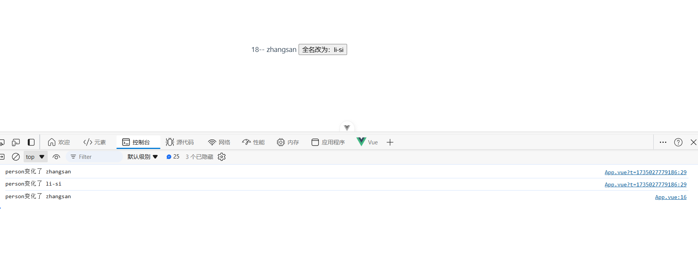

> 5：监视上述的多个数据

```html
<template>
  <div class="person">
    {{person.age}}-- {{person.name}}
    <button @click="changeFullName">全名改为：li-si</button>
  </div>
</template>

<script setup lang="ts" name="App">
  import {ref, watch, reactive} from 'vue'  //引入computed
  let person = reactive({
    name:'张三',
    age:18,
    car:{
      c1:'奔驰',
      c2:'宝马'
    }
  })
  // 监听多个数据
  watch([()=>person.name,()=>person.car],(newValue,oldValue)=>{
    console.log(newValue,oldValue)
  })
  const changeFullName = ()=>{
    person.name = '李四'
    person.age = 20
    person.car.c1 = '奔驰1'
    person.car.c2 = '宝马2'
  }
  
  
</script>
```

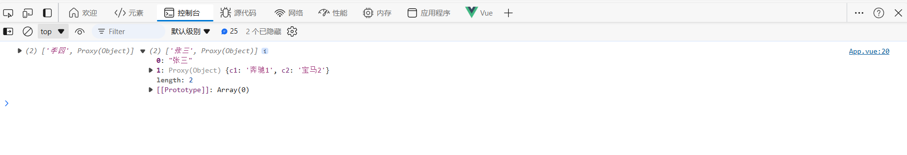

### 2.9 watchEffect

* 立即运行一个函数，同时响应式地追踪其依赖，并在依赖更改时重新执行该函数。

`watch`对比`watchEffect`

> 1. 都能监听响应式数据的变化，不同的是监听数据变化的方式不同
>
> 2. `watch`：要明确指出监视的数据
>
> 3. `watchEffect`：不用明确指出监视的数据（函数中用到哪些属性，那就监视哪些属性）

```html
<template>
  <div class="person">
    <h1>需求：水温达到50℃，或水位达到20cm，则联系服务器</h1>
    <h2 id="demo">水温：{{temp}}</h2>
    <h2>水位：{{height}}</h2>
    <button @click="changePrice">水温+1</button>
    <button @click="changeSum">水位+10</button>
  </div>
</template>

<script lang="ts" setup name="Person">
  import {ref,watch,watchEffect} from 'vue'
  // 数据
  let temp = ref(0)
  let height = ref(0)

  // 方法
  function changePrice(){
    temp.value += 10
  }
  function changeSum(){
    height.value += 1
  }

  // 用watch实现，需要明确的指出要监视：temp、height
  watch([temp,height],(value)=>{
    // 从value中获取最新的temp值、height值
    const [newTemp,newHeight] = value
    // 室温达到50℃，或水位达到20cm，立刻联系服务器
    if(newTemp >= 50 || newHeight >= 20){
      console.log('联系服务器')
    }
  })

  // 用watchEffect实现，不用
  const stopWtach = watchEffect(()=>{
    // 室温达到50℃，或水位达到20cm，立刻联系服务器
    if(temp.value >= 50 || height.value >= 20){
      console.log(document.getElementById('demo')?.innerText)
      console.log('联系服务器')
    }
    // 水温达到100，或水位达到50，取消监视
    if(temp.value === 100 || height.value === 50){
      console.log('清理了')
      stopWtach()
    }
  })
</script>
```

### 2.10  标签的 ref 属性

作用：用于注册模板引用。

> * 用在普通`DOM`标签上，获取的是`DOM`节点。
>
> * 用在组件标签上，获取的是组件实例对象。

> 普通标签

```html
<template>
  <div class="person">
    <h1 ref="title1">尚硅谷</h1>
    <h2 ref="title2">前端</h2>
    <h3 ref="title3">Vue</h3>
    <input type="text" ref="inpt"> <br><br>
    <button @click="showLog">点我打印内容</button>
  </div>
</template>

<script lang="ts" setup name="Person">
  import {ref} from 'vue'
        
  let title1 = ref()
  let title2 = ref()
  let title3 = ref()

  function showLog(){
    // 通过id获取元素
    const t1 = document.getElementById('title1')
    // 打印内容
    console.log((t1 as HTMLElement).innerText)
    console.log((<HTMLElement>t1).innerText)
    console.log(t1?.innerText)
    
                /************************************/
                
    // 通过ref获取元素
    console.log(title1.value)
    console.log(title2.value)
    console.log(title3.value)
  }
</script>
```

> 组件标签

```html
<!-- 父组件App.vue -->
<template>
  <Person ref="ren"/>
  <button @click="test">测试</button>
</template>

<script lang="ts" setup name="App">
  import Person from './components/Person.vue'
  import {ref} from 'vue'

  let ren = ref()

  function test(){
    console.log(ren.value.name)
    console.log(ren.value.age)
  }
</script>


<!-- 子组件Person.vue中要使用defineExpose暴露内容 -->
<script lang="ts" setup name="Person">
  import {ref,defineExpose} from 'vue'
        // 数据
  let name = ref('张三')
  let age = ref(18)
  /****************************/
  /****************************/
  // 使用defineExpose将组件中的数据导出交给外部
  defineExpose({name,age})
</script>
```

### 2.11 Props (父->子)

* 在 Vue 3 中，[父组件](https://so.csdn.net/so/search?q=%E7%88%B6%E7%BB%84%E4%BB%B6\&spm=1001.2101.3001.7020)可以通过 props 向子组件传递数据，子组件通过 defineProps 或 props 来定义它接收的属性，这些属性在子组件中可以直接使用

* 子组件

```html
<template>
    <!-- 接受父组件的值 -->
     <div>{{msg}}</div>
     <div>{{person.name}}</div>
     <div>{{person.age}}</div>
     <div>{{person.id}}</div>
</template>
<script lang="ts" setup name="Person">
import { defineProps } from 'vue';
defineProps(['msg','person'])

</script>
<style scoped lang="css">
  
</style>
```

* 父组件

```html
<template>
  <div>
    <Person msg="我是父组件的值" :person="person"></Person>
    <!-- 修改Person -->
     <button @click="person.age++">修改</button>
     <button @click="person.name='李四'">修改</button>
     <button @click="person.id++">修改</button>
  </div>
</template>

<script lang="ts" setup name="Main">
import Person from './components/Person.vue';
import { type PersonInter } from './types';
import { reactive } from 'vue';

const person:PersonInter =reactive({
  id:1,
  name:'张三',
  age:18
})
  
</script>
<style scoped lang="css">
  
</style>
```


> 类型限制

**定义 Props**：在子组件中，通过 props 选项或 defineProps（在组合式 API 中）定义需要从父组件接收的属性

```html
props: {
  title: String,
  likes: Number,
  isPublished: Boolean,
}

```

> 默认值与是否必填

**默认值和必填**：可以使用对象语法定义默认值、必填、类型验证等

```html
props: {
  title: {
    type: String,
    required: true,
  },
  likes: {
    type: Number,
    default: 0,
  },
}

```

> 自定义限制器

**自定义验证器**：可以提供一个函数进行自定义验证

```html
props: {
  title: {
    type: String,
    validator: (value) => value.length > 5,
  },
}

```

### 2.12 生命周期

* 概念：`Vue`组件实例在创建时要经历一系列的初始化步骤，在此过程中`Vue`会在合适的时机，调用特定的函数，从而让开发者有机会在特定阶段运行自己的代码，这些特定的函数统称为：生命周期钩子

* 规律：

> - 生命周期整体分为四个阶段，分别是：创建、挂载、更新、销毁，每个阶段都有两个钩子，一前一后。

* `Vue2`的生命周期

> - 创建阶段：`beforeCreate`、`created`
>
> - 挂载阶段：`beforeMount`、`mounted`
>
> - 更新阶段：`beforeUpdate`、`updated`
>
> - 销毁阶段：`beforeDestroy`、`destroyed`

* `Vue3`的生命周期

> - 创建阶段：`setup`
>
> - 挂载阶段：`onBeforeMount`、`onMounted`
>
> - 更新阶段：`onBeforeUpdate`、`onUpdated`
>
> - 卸载阶段：`onBeforeUnmount`、`onUnmounted`

* 常用的钩子：`onMounted`(挂载完毕)、`onUpdated`(更新完毕)、`onBeforeUnmount`(卸载之前)

```html
<template>
  <div class="person">
    <h2>当前求和为：{{ sum }}</h2>
    <button @click="changeSum">点我sum+1</button>
  </div>
</template>

<!-- vue3写法 -->
<script lang="ts" setup name="Person">
  import { 
    ref, 
    onBeforeMount, 
    onMounted, 
    onBeforeUpdate, 
    onUpdated, 
    onBeforeUnmount, 
    onUnmounted 
  } from 'vue'

  // 数据
  let sum = ref(0)
  // 方法
  function changeSum() {
    sum.value += 1
  }
  console.log('setup')
  // 生命周期钩子
  onBeforeMount(()=>{
    console.log('挂载之前')
  })
  onMounted(()=>{
    console.log('挂载完毕')
  })
  onBeforeUpdate(()=>{
    console.log('更新之前')
  })
  onUpdated(()=>{
    console.log('更新完毕')
  })
  onBeforeUnmount(()=>{
    console.log('卸载之前')
  })
  onUnmounted(()=>{
    console.log('卸载完毕')
  })
</script>
```

### 2.13 自定义hook

* 什么是`hook`？—— 本质是一个函数，把`setup`函数中使用的`Composition API`进行了封装，类似于`vue2.x`中的`mixin`。

* 自定义`hook`的优势：复用代码, 让`setup`中的逻辑更清楚易懂。

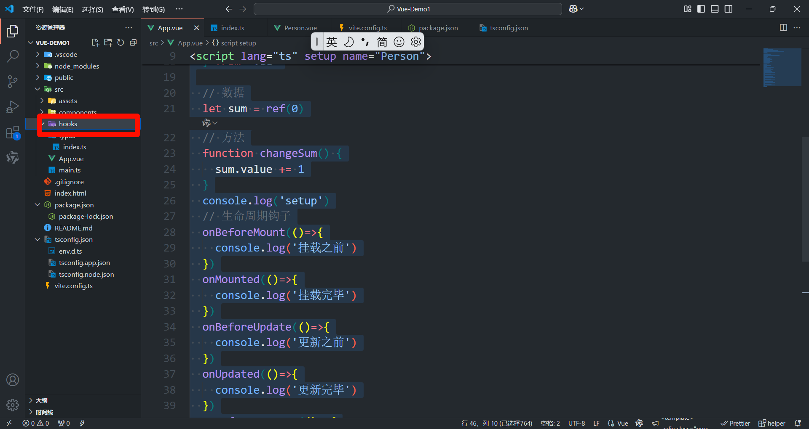

* useSum.ts

```html
import {ref,onMounted} from 'vue'export default function(){
  let sum = ref(0)

  const increment = ()=>{
    sum.value += 1
  }
  const decrement = ()=>{
    sum.value -= 1
  }
  onMounted(()=>{
    increment()
  })
 return {sum,increment,decrement}
}                
```

* useDog.ts

```html
import {reactive,onMounted} from 'vue'import axios,{AxiosError} from 'axios'export default function(){
  let dogList = reactive<string[]>([])

  // 方法async function getDog(){
    try {
      // 发请求let {data} = await axios.get('https://dog.ceo/api/breed/pembroke/images/random')
      // 维护数据
      dogList.push(data.message)
    } catch (error) {
      // 处理错误const err = <AxiosError>error
      console.log(err.message)
    }
  }

  // 挂载钩子
  onMounted(()=>{
    getDog()
  })
        
  //向外部暴露数据
  return {dogList,getDog}
}
```

* 使用

```html
<template>
  <h2>当前求和为：{{sum}}</h2>
  <button @click="increment">点我+1</button>
  <button @click="decrement">点我-1</button>
  <hr>
   
  <span v-show="dogList.isLoading">加载中......</span><br>
  <button @click="getDog">再来一只狗</button>
</template>

<script lang="ts">
  import {defineComponent} from 'vue'
  export default defineComponent({
    name:'App',
  })
</script>

<script setup lang="ts">
  // 引入定有的hooks
  import useSum from './hooks/useSum'
  import useDog from './hooks/useDog'
  let {sum,increment,decrement} = useSum()
  let {dogList,getDog} = useDog()
</script>
```

## 三 路由

* 参考：https://router.vuejs.org/zh/

Vue Router 是 [Vue.js](https://cn.vuejs.org/) 的官方路由。它与 Vue.js 核心深度集成，让用 Vue.js 构建单页应用变得轻而易举。功能包括：

* 嵌套路由映射

* 动态路由选择

* 模块化、基于组件的路由配置

* 路由参数、查询、通配符

* 展示由 Vue.js 的过渡系统提供的过渡效果

* 细致的导航控制

* 自动激活 CSS 类的链接

* HTML5 history 模式或 hash 模式

* 可定制的滚动行为

* URL 的正确编码

### 3.1 安装

* 安装依赖

```bash
npm install vue-router@4
```

* 引入路由配置文件

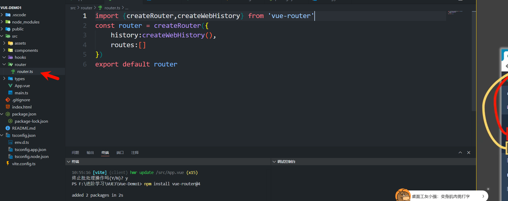

```bash
import {createRouter,createWebHistory} from 'vue-router'
const router = createRouter({
    history:createWebHistory(),
    routes:[]
})
export default router
```

* 挂载主文件

```bash
import './assets/main.css'
import router from './router/router'
import { createApp } from 'vue'
import App from './App.vue'

createApp(App)
.use(router)
.mount('#app')
```

### 3.2 简单使用

```javascript
import {createRouter,createWebHistory} from 'vue-router'
import Home from '@/components/Home.vue'
import Person from '@/components/Person.vue'
const router = createRouter({
    history:createWebHistory(),
    routes:[
        {path:'/',component:Home},
        {path:'/person',component:Person}
    ]
})
export default router
```

* 主入口

```javascript
<template>
  <div class="app-container">
    <!-- 切换菜单 -->
    <nav class="menu">
      <router-link to="/" class="menu-item">首页</router-link>
      <router-link to="/person" class="menu-item">个人页</router-link>
    </nav>
    <!-- 路由 -->
    <router-view></router-view>
  </div>
</template>

<script lang="ts" setup name="Main">
import {
  onBeforeMount,
  onMounted,
  onBeforeUpdate,
  onUpdated,
  onBeforeUnmount,
  onUnmounted,
} from "vue";

console.log("setup");

// 生命周期钩子
onBeforeMount(() => {
  console.log("挂载之前");
});
onMounted(() => {
  console.log("挂载完毕");
});
onBeforeUpdate(() => {
  console.log("更新之前");
});
onUpdated(() => {
  console.log("更新完毕");
});
onBeforeUnmount(() => {
  console.log("卸载之前");
});
onUnmounted(() => {
  console.log("卸载完毕");
});
</script>

<style scoped>
.app-container {
  font-family: Arial, sans-serif;
  padding: 20px;
}

.menu {
  display: flex;
  justify-content: space-between;
  margin-bottom: 20px;
  background-color: #f8f8f8;
  padding: 10px;
  border-radius: 5px;
  box-shadow: 0 2px 4px rgba(0, 0, 0, 0.1);
}

.menu-item {
  color: #333;
  text-decoration: none;
  padding: 8px 16px;
  transition: background-color 0.3s, color 0.3s;
}

.menu-item:hover {
  background-color: #007bff;
  color: white;
  border-radius: 5px;
}

.menu-item.router-link-active {
  font-weight: bold;
  color: #007bff;
}
</style>
```

* 页面

```javascript
<template>
    <div>我是首页</div>
</template>

<script lang="ts" setup name="home">

  
</script>
<style scoped lang="css">
  
</style>


<template>
    <div>我是个人页</div>
</template>

<script lang="ts" setup name="Person">

  
</script>
<style scoped lang="css">
  
</style>
```

* 效果


> 注意点

> 1. 路由组件通常存放在`pages` 或 `views`文件夹，一般组件通常存放在`components`文件夹。
>
> 2. 通过点击导航，视觉效果上“消失” 了的路由组件，默认是被卸载掉的，需要的时候再去挂载。

* 路由组件：靠路由规则渲染出来的。`route:[{path:/demo,component:demo}]`

* 一般组件：亲手写出来的标签。`<demo/>`

### 3.3 路由器工作模式

1. `history`模式

> * 优点：`URL`更加美观，不带有`#`，更接近传统的网站`URL`。
>
> * 缺点：后期项目上线，需要服务端配合处理路径问题，否则刷新会有`404`错误。
>
> ```plain&#x20;text
> const router = createRouter({history:createWebHistory(), //history模式/******/
> })
> ```
>
> 1. 各版本：
>
> 2. vue2——`mode:'history'`
>
> 3. vue3——`history:createWebHistory()`
>
> 4. React——`BrowserRouter`

* `hash`模式

> - 优点：兼容性更好，因为不需要服务器端处理路径。
>
> - 缺点：`URL`带有`#`不太美观，且在`SEO`优化方面相对较差。
>
> ```plain&#x20;text
> const router = createRouter({history:createWebHashHistory(), //hash模式/******/
> })
> ```

### 3.4 To的两种写法

```javascript
      <!-- 第一种：to的字符串写法 -->
      <router-link to="/" class="menu-item">首页</router-link>
      <router-link to="/person" class="menu-item">个人页</router-link>
      <!--  第二种：to的对象写法  -->
      <router-link class="menu-item" :to="{path:'/home'}">Home</router-link>
```

### 3.5 命名路由

* 当创建一个路由时，我们可以选择给路由一个 `name`

```javascript
const routes = [
  {
    path: '/user/:username',
    name: 'profile', 
    component: User
  }
]
```

* 然后我们可以使用 `name` 而不是 `path` 来传递 `to` 属性给 `<router-link>`：

```javascript
<router-link :to="{ name: 'profile', params: { username: 'erina' } }">
  User profile
</router-link>
```

使用 `name` 有很多优点：

* 没有硬编码的 URL。

* `params` 的自动编码/解码。

* 防止你在 URL 中出现打字错误。

* 绕过路径排序，例如展示一个匹配相同路径但排序较低的路由。

### 3.6 嵌套路由

一些应用程序的 UI 由多层嵌套的组件组成。在这种情况下，URL 的片段通常对应于特定的嵌套组件结构，例如：

```plain&#x20;text
/user/johnny/profile                   /user/johnny/posts 
┌──────────────────┐                  ┌──────────────────┐
│ User             │                  │ User             │
│ ┌──────────────┐ │                  │ ┌──────────────┐ │
│ │ Profile      │ │  ●────────────▶  │ │ Posts        │ │
│ │              │ │                  │ │              │ │
│ └──────────────┘ │                  │ └──────────────┘ │
└──────────────────┘                  └──────────────────┘
```

```javascript
const routes = [
  {
    path: '/user/:id',
    component: User,
    children: [
      {
        // 当 /user/:id/profile 匹配成功
        // UserProfile 将被渲染到 User 的 <router-view> 内部
        path: 'profile',
        component: UserProfile,
      },
      {
        // 当 /user/:id/posts 匹配成功
        // UserPosts 将被渲染到 User 的 <router-view> 内部
        path: 'posts',
        component: UserPosts,
      },
    ],
  },
]
```

### 3.7 路由参数

* query参数

> 传递参数

```javascript
<!-- 跳转并携带query参数（to的字符串写法） -->
<router-link to="/news/detail?a=1&b=2&content=欢迎你">
        跳转
</router-link>
                                
<!-- 跳转并携带query参数（to的对象写法） -->
<RouterLink 
  :to="{
    //name:'xiang', //用name也可以跳转
    path:'/news/detail',
    query:{
      id:news.id,
      title:news.title,
      content:news.content
    }
  }"
>
  {{news.title}}
</RouterLink>
```

> 接受参数

```javascript
import {useRoute} from 'vue-router'const route = useRoute()
// 打印query参数console.log(route.query)
```

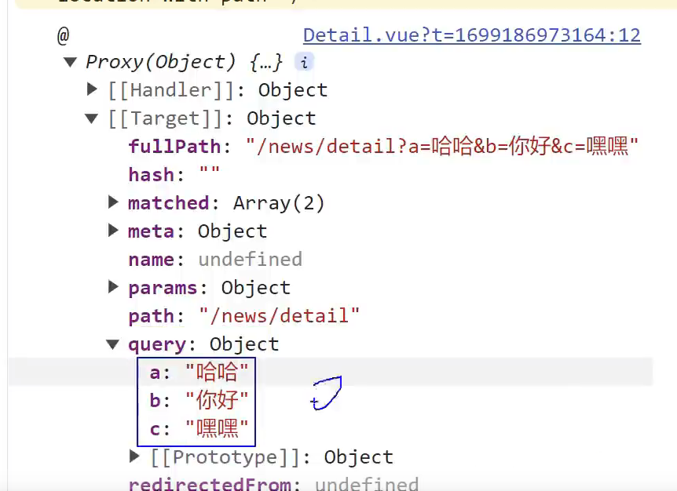

* params参数

> 传递参数

```javascript
<!-- 跳转并携带params参数（to的字符串写法） -->
<RouterLink :to="`/news/detail/001/新闻001/内容001`">{{news.title}}</RouterLink>
                                
<!-- 跳转并携带params参数（to的对象写法） -->
<RouterLink 
  :to="{
    name:'xiang', //用name跳转
    params:{
      id:news.id,
      title:news.title,
      content:news.title
    }
  }"
>
  {{news.title}}
</RouterLink>
```

> 接受参数

```javascript
import {useRoute} from 'vue-router'const route = useRoute()
// 打印params参数console.log(route.params)
```

备注1：传递`params`参数时，若使用`to`的对象写法，必须使用`name`配置项，不能用`path`。

备注2：传递`params`参数时，需要提前在规则中占位。

### 3.8 路由的props配置

* 作用：让路由组件更方便的收到参数（可以将路由参数作为`props`传给组件）

```javascript
{
        name:'xiang',
        path:'detail/:id/:title/:content',
        component:Detail,

          // props的对象写法，作用：把对象中的每一组key-value作为props传给Detail组件// props:{a:1,b:2,c:3}, // props的布尔值写法，作用：把收到了每一组params参数，作为props传给Detail组件// props:true// props的函数写法，作用：把返回的对象中每一组key-value作为props传给Detail组件
          props(route){
            return route.query
          }
}
```

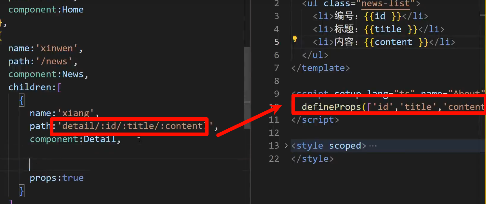

### 3.9 replace属性

1. 作用：控制路由跳转时操作浏览器历史记录的模式。

2. 浏览器的历史记录有两种写入方式：分别为`push`和`replace`：

   * `push`是追加历史记录（默认值）。

   * `replace`是替换当前记录。

3. 开启`replace`模式：

```plain&#x20;text
<RouterLink replace .......>News</RouterLink>
```

### 3.10 编程式导航

路由组件的两个重要的属性：`$route`和`$router`变成了两个`hooks`

```javascript
import {useRoute,useRouter} from 'vue-router'const route = useRoute()
const router = useRouter()

console.log(route.query)
console.log(route.parmas)
console.log(router.push)
console.log(router.replace)
```

### 3.11 重定向

* 作用：将特定的路径，重新定向到已有路由。

```javascript
{
    path:'/',
    redirect:'/about'
}
```

## 四 状态管理 （pinia）

* 参考网站：https://pinia.web3doc.top/

Pinia 是 Vue 的存储库，它允许您跨组件/页面共享状态。 如果您熟悉 Composition API，您可能会认为您已经可以通过一个简单的 `export const state = reactive({})`. 这对于单页应用程序来说是正确的，但如果它是服务器端呈现的，会使您的应用程序暴露于安全漏洞。

### 4.1 安装

```bash
npm install pinia
```

* 主文件引入pinia

```javascript
import './assets/main.css'
import router from './router/router'
import { createApp } from 'vue'
import App from './App.vue'
import { createPinia } from 'pinia'

createApp(App)
.use(router)
.use(createPinia())
.mount('#app')

```

### 4.2 存储+读取数据

1. `Store`是一个保存：状态、业务逻辑 的实体，每个组件都可以读取、写入它。

2. 它有三个概念：`state`、`getter`、`action`，相当于组件中的： `data`、 `computed` 和 `methods`。

* 定义文件夹

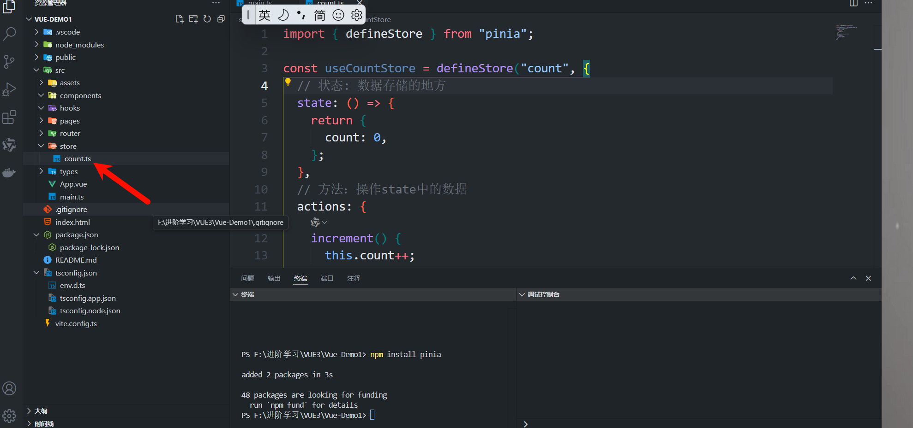

```javascript
import { defineStore } from "pinia";

const useCountStore = defineStore("count", {
  // 状态: 数据存储的地方
  state: () => {
    return {
      count: 0,
    };
  },
  // 方法：操作state中的数据
  actions: {
    increment() {
        console.log('increment')
      this.count++;
    },
  },
  //   计算属性
  getters: {
    doubleCount: (state) => {
      return state.count * 2;
    },
  },
});
export default useCountStore;
```

* 使用

```javascript
import useCountStore from "./store/count";
// 获取值
console.log(useCountStore());
console.log(useCountStore().count);
// 修改值1：调用方法
useCountStore().increment()
// 修改值2：直接修改
useCountStore().count=2
// 修改值3：批量修改
useCountStore().$patch({ count: 100 });
```

* 定义Store的组合式

```javascript
import { defineStore } from 'pinia';
import { ref } from 'vue';

export const useCountStore = defineStore('count', () => {
  // 状态 (state)
  const count = ref(0);

  // 动作 (actions)
  const increment = () => {
    count.value++;
  };

  const decrement = () => {
    count.value--;
  };
  // getters
  const doubleCount = () => {
    return count.value * 2;
  };

  return { count, increment, decrement,doubleCount };
});

// 如果你想导出为默认模块，请确保只导出 store 而不是定义语句
export default useCountStore;
```

### 4.3 storeToRefs

* 借助`storeToRefs`将`store`中的数据转为`ref`对象，方便在模板中使用。

* 注意：`pinia`提供的`storeToRefs`只会将数据做转换，而`Vue`的`toRefs`会转换`store`中数据。

```javascript
<template>
        <div class="count">
                <h2>当前求和为：{{sum}}</h2>
        </div>
</template>

<script setup lang="ts" name="Count">
  import { useCountStore } from '@/store/count'
  /* 引入storeToRefs */
  import { storeToRefs } from 'pinia'

  /* 得到countStore */
  const countStore = useCountStore()
  /* 使用storeToRefs转换countStore，随后解构 */
  const {sum} = storeToRefs(countStore)
</script>

```

### 4.4 getters

1. 概念：当`state`中的数据，需要经过处理后再使用时，可以使用`getters`配置。

2. 追加`getters`配置。

```javascript
// 引入defineStore用于创建storeimport {defineStore} from 'pinia'// 定义并暴露一个storeexport const useCountStore = defineStore('count',{
  // 动作actions:{
    /************/
  },
  // 状态
  state(){
    return {
      sum:1,
      school:'atguigu'
    }
  },
  // 计算getters:{
    bigSum:(state):number => state.sum *10,
    upperSchool():string{
      return this. school.toUpperCase()
    }
  }
})
```

### 4.5 $subscribe

* 通过 store 的 `$subscribe()` 方法侦听 `state` 及其变化

```javascript
talkStore.$subscribe((mutate,state)=>{
  console.log('LoveTalk',mutate,state)
  localStorage.setItem('talk',JSON.stringify(talkList.value))
})
```

## 五 组件通信

### 5.1 父与子组件通信 （props）

概述：`props`是使用频率最高的一种通信方式，常用与 ：父 ↔ 子。

* 若 父传子：属性值是非函数。

> 父->子

child组件

```javascript
<template>
  <div>{{ props.name }}</div>
</template>
 
<script setup>
import { defineProps } from 'vue'
 
const props = defineProps({
  name: {
    type: String,
    default: '',
  },
})
</script>
```

father组件

```javascript
<template>
  <child :name="name"></child>
</template>
 
<script setup>
import { ref } from 'vue'
import Child from './Child.vue'
 
const name = ref('小明')
</script>
```

> 子组件向父组件传递数据 (Emit)

子组件可以通过触发事件的方式向父组件传递数据。

* 子组件

```javascript
<template>
  <button @click="handleClick">点击我</button>
</template>
 
<script setup>
import { ref, defineEmits } from 'vue'
 
const message = ref('来自子组件的问候')
const emits = defineEmits(['greet'])
 
const handleClick = () => {
  emits('greet', message.value)
}
</script>
```

* 父组件

```javascript
<template>
  <child @greet="handleGreet"></child>
</template>
 
<script setup>
import { ref } from 'vue'
import Child from './Child.vue'
 
const handleGreet = (message) => {
  console.log(message) // 输出: "来自子组件的问候"
}
</script>
```

### 5.2 消息总线（兄弟组件通信）

* 对于兄弟组件之间的通信,我们可以使用第三方库 mitt 来实现一个简单的事件总线。

> 安装使用

```javascript
npm install --save mitt
```

> 注册

```javascript
import { createApp } from 'vue'
import mitt from 'mitt'
import App from './App.vue'
 
const app = createApp(App)
app.config.globalProperties.$bus = mitt()
 
app.mount('#app')
```

组件一

```javascript
<script setup>
import { getCurrentInstance } from 'vue'
 
const { proxy } = getCurrentInstance()
const sendMessage = () => {
  proxy.$bus.emit('myEvent', '你好,兄弟')
}
</script>
```

组件二

```javascript
<script setup>
import { onMounted, getCurrentInstance } from 'vue'
 
const { proxy } = getCurrentInstance()
 
onMounted(() => {
  proxy.$bus.on('myEvent', (message) => {
    console.log(message) // 输出: "你好,兄弟"
  })
})
</script>
```

### 5.3 依赖注入 (Provide/Inject)

provide 和 inject 允许祖先组件向所有子孙组件传递数据,而不需要通过每一层组件手动传递。

祖组件

```javascript
<script setup>
import { provide, ref } from 'vue'
 
const themeColor = ref('blue')
provide('theme', themeColor)
</script>
```

孙组件

```javascript
<script setup>
import { inject } from 'vue'
 
const theme = inject('theme')
console.log(theme.value) // 'blue'
</script>
```

### 5.4 插槽（ slot）

[Vue 3](https://so.csdn.net/so/search?q=Vue%203\&spm=1001.2101.3001.7020)中的插&#x69FD;**&#x20;slot&#x20;**&#x662F;一种用于复用组件的机制。它允许你在组件的模板中定义一些可替换的内容，然后在使用该组件时填充这些内容 ，在Vue 3中，插槽被称&#x4E3A;**`<slot>`**&#x5143;素。你可以在组件的模板中使&#x7528;**`<slot>`**&#x5143;素来声明一个插槽

> 默认插槽

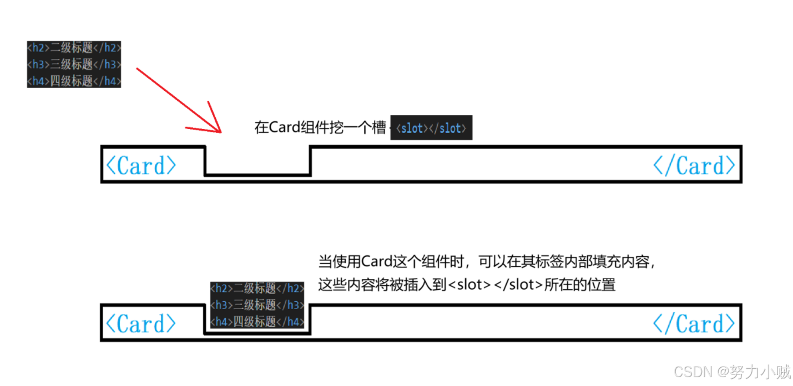

```javascript
//子组件Card
 
<template>
    <!-- 定义一个默认插槽（不需要命名） -->
  <div>
    <h1>标题</h1>
    <slot></slot>
    <p>底部内容</p>
  </div>
</template>
<script setup></script>
<style></style>
```

```javascript
//父组件APP
 
<template>
  <div>
    <Card>
      <!-- 【实验1】把代码片段插入默认插槽，可以不使用<template>标签封装 -->
      <p>这是自定义的内容(会被默认插入默认插槽)</p>
      <h3>我是插入默认插槽的三级标题</h3>
    </Card>
  </div>
</template>
 
<script setup>
  import Card from './components/Card.vue';
</script>
```

在上面的示例中，在[子组件](https://so.csdn.net/so/search?q=%E5%AD%90%E7%BB%84%E4%BB%B6\&spm=1001.2101.3001.7020)&#x7528;**&#x20;`<slot></slot>`**&#x58F0;明了一个名为默认插槽的插槽。当你在[父组件](https://so.csdn.net/so/search?q=%E7%88%B6%E7%BB%84%E4%BB%B6\&spm=1001.2101.3001.7020)中使用这个组件时，可以在其标签内部填充内容 \<p>\</p>、\<h3>\</h3>，这些内容将被插入&#x5230;**`<slot></slot>`**&#x6240;在的位置。&#x20;

> 具名插槽

除了默认插槽，Vue 3还引入了**具名插槽**。你可以&#x5728;**`<slot>`**&#x5143;素上使&#x7528;**`name`**&#x5C5E;性来定义一个具名插槽

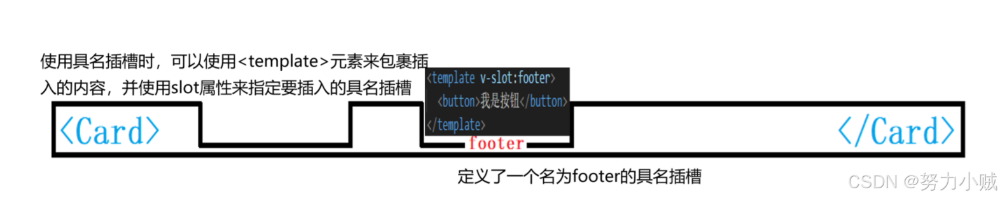

```javascript
//子组件Card
 
<template>
  <div>
    <!-- 定义一个默认插槽（不需要命名） -->
    <div>
      <h1>标题</h1>
      <slot></slot>
      <p>底部内容</p>
    </div>
    <!-- 定义一个具名插槽（需要通过name命名，最常用） -->
    <div>
      <slot name="footer"></slot>
    </div> 
  </div>
</template>

<script setup></script>
 
<style></style>
```

在上面的示例中，除了默认插槽外，还定义了一个名为`footer`的具名插槽。

当使用具名插槽时，可以使&#x7528;**`<template>`**&#x5143;素来包裹插入的内容，并使&#x7528;**`v-slot:`**&#x6307;定要插入的具名插槽。&#x20;

```javascript
//父组件APP
 
<template>
  <div>
    <Card>
      <!-- 【实验2】把代码片段插入具名插槽，必须使用<template>标签封装，并且用v-slot:指定插槽的名字，v-slot:简写形式为# -->
      <template v-slot:footer>
        <button @click="handleClick">我是插入具名插槽的按钮</button>
      </template>
    </Card>
  </div>
</template>
 
<script setup>
  import Card from './components/Card.vue';
  const handleClick = () => {
    alert('插入具名插槽的按钮被点击了！');
  };
</script>
```

&#x20;**`v-slot:`**&#x7B80;写形式为 **#** ：

```html
      <!-- v-slot:简写形式为# -->
      <template #footer>
        <button @click="handleClick">我是插入具名插槽的按钮</button>
      </template>
```

在上面的示例中，`<button @click="handleClick"> </button>`将被插入到组件的模板中的具名插槽`footer`所在的位置。

> 作用域插槽

作用域插槽的实现方式是通过在父组件中使&#x7528;**`<template>`**&#x5143;素来定义插槽，然后在子组件中使用`<slot>`元素，并将数据通过插槽属性进行传递。

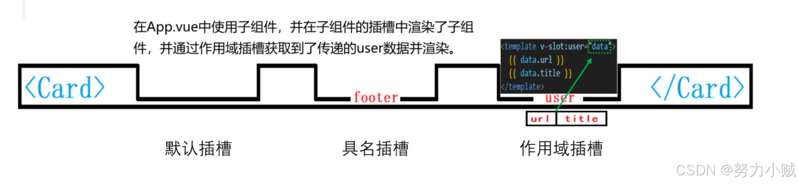

在子组件中，定义一个作用域插槽（需要通过**name**命名，所以它也是具名插槽的一种，但要求在插槽里配置一些数据），子组件将 url 和 title 数据配置到 name="user" 的插槽中

```javascript
//子组件Card
 
<template>
    <!-- 定义一个作用域插槽（需要通过name命名，所以它也是具名插槽的一种，但要求在插槽里配置一些数据） -->
    <div>
      <slot name="user" url="www.baidu.com" title="百度一下"></slot>
    </div>
</template>
 
<script setup></script>
 
<style>
</style>
```

&#x20;父组件将某个片段插入该插槽时，便可通过 v-slot:user="data" (data是随便取的名字) 来接收这些数据

```javascript
//父组件APP
 
<template>
  <div>
    <Card>
      <!-- 【实验4】作用域插槽：子组件将url和title数据配置到 name="user" 的插槽中,
       当父组件将某个片段插入该插槽时，便可通过 v-slot:user="data" (data是随便取的名字) 来接收这些数据-->
      <template v-slot:user="data">  
        子组件通过作用域插槽传来的数据: {{ data.url }} ， {{ data.title }}
      </template>   
    </Card>
  </div>
</template>
 
<script setup>
  import Card from './components/Card.vue';
</script>
```